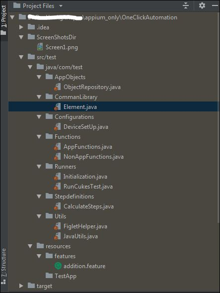

<h2 align="center">
	One click Native Mobile APP automation | Appium-Java-Cucumber
</h2>

_______________________________

# AppiumCucumber
Sample one click Appium Automation

## Running the Test

(_for those you are all set and tested appium cli in past_)
> $ `git clone https://github.com/eaccmk/OneClickAutomation.git `
> $ `sh sh run_test.sh`

**For other like me who learnt from their mistake; 
researched and then finally made it please flow this first**

## Pre-requisites (before you do that 1 click)
* Android tool :https://developer.android.com/studio#Other (check /platform-tools & /tools has`adb.exe`)
* Appium 1.14.0 (`appium -v`)
* Java 8 (JAVA_HOME) (`java -version`)
* Maven (MAVAN_HOME) (`mvn -v`)
* IDE with Cucumber Plugin installed (_research_ http://www.google.com/search?q=install+Cucumber+Plugin)
* Get started with Appiumhere http://appium.io/docs/en/about-appium/getting-started/)

## Project Structure

-------------------------------------
_credits_ : Initial reference of this project was made using [this github repo](https://github.com/SrinivasanTarget/AppiumCucumber.git) **Kudos!**

