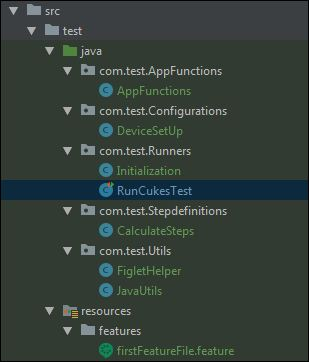

<h1 align="center">
	One click Native Mobile APP automation | Appium-Java-Cucumber
</h1>

# AppiumCucumber
Sample one click Appium Automation

_for those you are all set and tested appium cli in past_
## Running the Test
$ `git clone https://github.com/SrinivasanTarget/AppiumCucumber.git `

$ `mvn clean install`

_For other like me who learnt from miskates and researcher and then finally made it here: Dont forget to read and Floow this_

## Pre-requisites (before you do that 1 click)
* Android tool :https://developer.android.com/studio#Other (make sure you have /platform-tools and /tools having `adb.exe`)
* Appium 1.14.0 (`appium -v`)
* Java 8 (JAVA_HOME) (`java -version`)
* Maven (MAVAN_HOME) (`mvn -v`)
* IDE with Cucumber Plugin installed (_research_ http://www.google.com/search?q=install+Cucumber+Plugin)
* Get started with Appiumhere http://appium.io/docs/en/about-appium/getting-started/)

## Project Structure

* Configuration package - Hooks and API Processor
* Runners - Cucumber Runner Test
* Screens - Page Classes with Page Actions defined
* Step Definitions - Screen and its Steps Defs.
* Features - cucumber features

